# Architecture

The RiscZero-Cartesi integration combines RiscZero's zero-knowledge proof capabilities with Cartesi's scalable computation environment. This integration involves three main components:

- RiscZero Host Program
- RiscZero Guest Program
- Verifier program (Cartesi Machine)



## RiscZero Host Program

The host program is the entry point that:
- Initializes the zkVM environment
- Prepares and sends inputs to the guest program
- Generates zero-knowledge proofs of the guest program's execution
- Produces a receipt containing:
  - Journal: Public outputs of the computation
  - Seal: Cryptographic proof of correct execution

```rust
// Example host structure
fn main() {
    // Initialize zkVM environment
    let env = ExecutorEnv::builder()
        .write(&input)
        .build();

    // Generate proof
    let receipt = prover.prove(env, GUEST_ELF).unwrap();
    
    // Serialize receipt for Cartesi verification
    let receipt_bytes = bincode::serialize(&receipt).unwrap();
}
```

## RiscZero Guest Program


The guest program runs inside the zkVM and:
- Receives inputs from the host
- Performs the computation that needs to be proven
- Commits results to the journal
- Maintains privacy of intermediate computations

```rust
// Example guest structure
fn main() {
    // Read input from host
    let input: Type = env::read();

    // Perform private computation
    let result = compute(input);

    // Commit result to public journal
    env::commit(&result);
}
```

## Verifier program (Cartesi Machine)

The verifier program written in Rust will be running inside the Cartesi Machine that:
- Receives the serialized receipt
- Deserializes it
- Verifies the proof
- Outputs the result

```rust
	// Example verifier structure
fn main() {
    // Read receipt from input drive
    let receipt: Receipt = deserialize(&receipt_data);
    
    // Verify the proof
    match receipt.verify(image_id) {
        Ok(_) => println!("Proof verified!"),
        Err(e) => println!("Verification failed: {:?}", e)
    }
}
```


